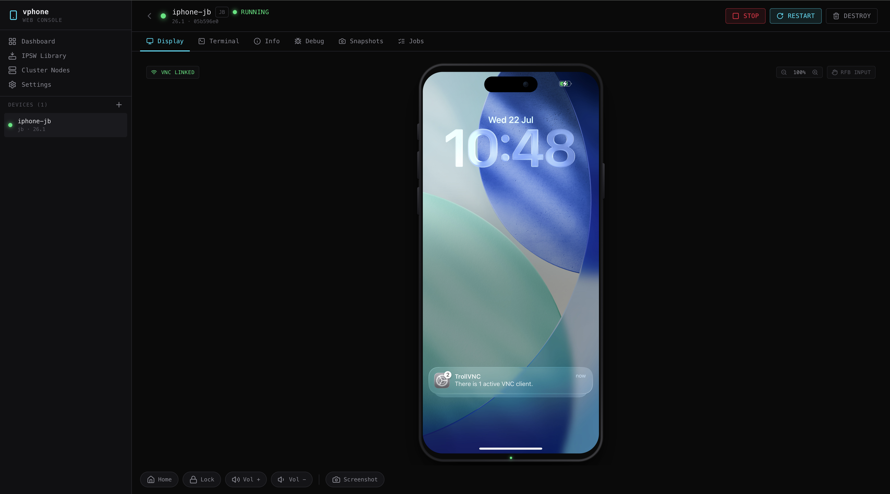
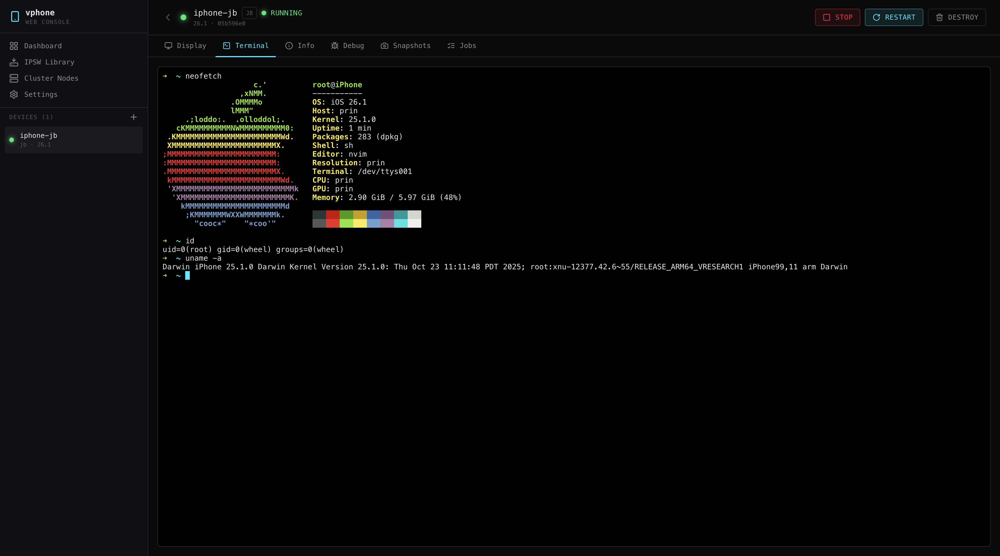
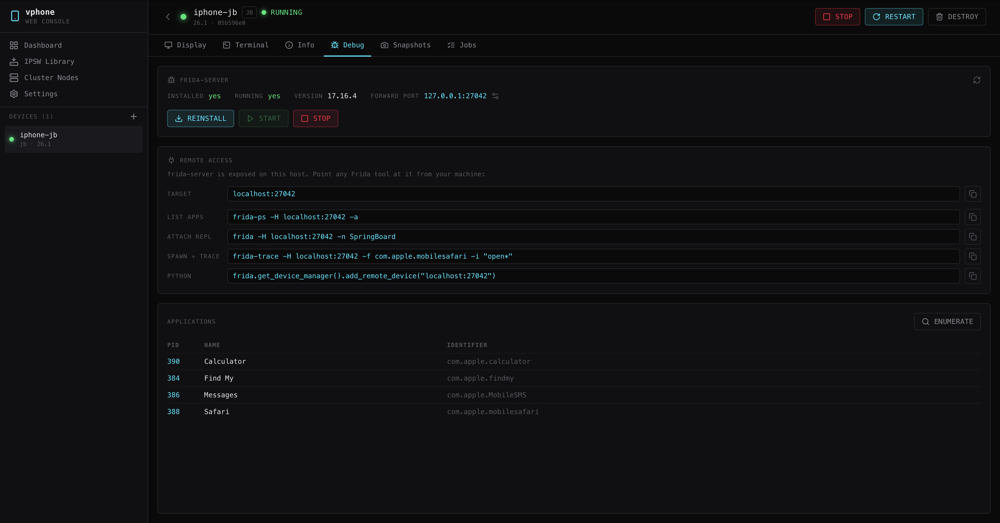

# vphone-web

Self-hosted web management platform for virtualized iPhones — a Corellium-inspired
console wrapping [vphone-cli](https://github.com/Lakr233/vphone-cli). Built for
red-team engineers and security researchers managing jailbroken iOS VMs for
vulnerability research, exploit development, and device instrumentation.

The Go server drives the real `vphone-cli` Make targets end-to-end: it builds
firmware, runs the restore/CFW pipeline as streamed background jobs, boots VMs,
and proxies their VNC display, SSH terminal, and control socket into the browser.

> **Status:** verified end-to-end — a real `iPhone17,3 / iOS 26.1 (23B85)` JB
> image was provisioned (fw_prepare → fw_patch_jb → restore → cfw_install_jb),
> booted to **SpringBoard**, and driven live from the browser: noVNC display with
> mouse+keyboard input, an interactive SSH terminal, touch, and hardware keys.
> The console renders the device inside a Corellium-style iPhone shell.

## Screenshots

Live iOS SpringBoard over noVNC, rendered inside the iPhone device frame:



Interactive SSH terminal (xterm.js over a real server-side SSH client):



Debug tab — `frida-server` management, remote-access commands, and live app
enumeration via `frida-ps`:



## What it does

- **IPSW library** — register a firmware file already on disk (no copy), upload
  one, or download from a URL as a background job.
- **Guided VM creation** — pick an IPSW, variant (Regular / Dev / JB / EXP), and
  resources; the server chains `vm_new → fw_prepare → fw_patch_<variant> →
  restore → cfw_install_<variant>` as jobs, streaming each step's logs live and
  advancing the VM through CREATING → RESTORING → INSTALLING_CFW → STOPPED.
- **Live display** — noVNC canvas over a WebSocket→TCP proxy, rendered inside a
  realistic iPhone device frame (Dynamic Island, bezel, side buttons) with a zoom
  control. Native RFB input (mouse **+ keyboard**) plus an optional socket-touch
  mode that injects precise taps/swipes through `vphone.sock`. noVNC authenticates
  to the guest TrollVNC server automatically.
- **Headless VMs** — boot with no host window (`headless_vms`); the guest VNC,
  SSH, and control socket all work off-screen, so the web console is the only display.
- **SSH terminal** — xterm.js backed by a real server-side SSH client + PTY
  (`golang.org/x/crypto/ssh`), with window-resize support and auto-reconnect.
- **Hardware controls** — Home / Lock / Volume via `vphone.sock`, plus screenshot
  capture and download (full-resolution PNG).
- **Frida / debugging** — a Debug tab manages the guest's `frida-server` (install
  from the Frida APT repo as a streamed job, start/stop, version/status) and
  enumerates running applications live via the host `frida-ps` over a forwarded
  frida port — the foundation for dynamic instrumentation.
- **Editable config** — while a VM is stopped, tweak its name, CPU, memory, and
  network (mode + bridge interface) from the Info panel's gear; changes are
  written back into the VM's `config.plist` for the next boot. The gear is
  disabled while the VM is running. The Info panel also shows the guest's live
  IP address (read from the control socket).
- **Adopt existing VMs** — import a VM directory provisioned directly by
  vphone-cli (Import Device), and delete VMs as a tracked job with live progress.
- **Export / import bundles** — export a stopped VM to a `.vphonevm.zip`
  (metadata + bootable image + firmware, sparse-disk-friendly) and import it on
  any instance or node — for sharing images and moving VMs between hosts.
- **Networking** — per-VM NAT (shared) or **bridged** (the VM joins the physical
  LAN with its own DHCP lease, so peers can SSH it directly). The create wizard
  picks the host bridge interface and flags Wi-Fi (bridging needs a wired NIC).
- **Access control** — optional users/roles (`vphone-admin` / `vphone-user`),
  disabled by default. Local bcrypt accounts + **LDAP/AD** (search-then-bind),
  **OIDC/OAuth2** and **SAML 2.0** SSO; directory groups map to roles.
- **Clustering** — a controller manages worker nodes (`vphone-web --agent`),
  registered by address + system password and health-monitored (ONLINE/OFFLINE).
- **Snapshots** — create / restore / delete backups (`vm_backup` / `vm_switch`),
  isolated per VM.
- **Dashboard** — VM fleet by status, running count, active jobs, host disk usage.
- **Resilience** — startup reconciliation kills orphaned processes and returns
  ports to the pool; interrupted provisioning is surfaced as ERROR with logs.

## Requirements

- macOS 15+ on Apple Silicon (Virtualization.framework), non-nested host
- SIP/AMFI configured per the [vphone-cli prerequisites](vphone-cli/README.md)
- Go 1.22+, Node 18+/npm
- The `vphone-cli` submodule built (see below)

Live iOS restore additionally needs a real 5–10 GB IPSW and (for `cfw_install`)
passwordless `sudo` for the offline disk-mount step — `cfw_install` re-execs under
sudo, so run the server where that is permitted. Failures at any step are visible
in the job log and the VM's ERROR banner; nothing is silently swallowed.

> **pymobiledevice3 restore patch:** on macOS the pmd3 restore hangs at 100% CPU
> because it doesn't release the pre-reset libusb handle before re-enumerating the
> DFU device. The server self-heals this on startup (`internal/vm/pmd3patch.go`)
> by patching the venv's `irecv.py`. If you rebuild the venv, the server re-applies
> it on next start.

## Quick start

```bash
git submodule update --init --recursive   # vphone-cli + its submodules
make cli                                   # build vphone-cli (toolchain, venv, signed binary)

make tools                                 # once: install `air` for Go hot reload
make dev                                   # Go API :8080 (proxies → Vite :5173). Open http://localhost:8080

# Production single binary (embeds the built frontend):
make build && ./bin/vphone-web
```

Zero configuration is required — the server runs on defaults and can also be run
straight from source: `go run ./cmd/vphone-web`.

## Architecture

```
cmd/vphone-web         entrypoint (config → db → jobs → ipsw → vm manager → server)
internal/config        TOML config with defaults + env overrides
internal/db            SQLite connection + embedded SQL migrations
internal/jobs          SQLite-backed job queue: concurrency-limited, live log fan-out
internal/ipsw          IPSW library (register/upload/download/delete)
internal/vm            VM lifecycle, provisioning pipeline, port allocator,
                       process supervision, vphone.sock client, snapshots, reconcile
internal/proxy         WebSocket↔TCP bridges (VNC, SSH) + job-log streamer
internal/api           Chi router, JSON handlers, WS endpoints, static serving
web/                   React + TS frontend (embedded into the binary at build time)
```

### How it drives vphone-cli

Every operation shells out to a `vphone-cli` Make target with `cmd.Dir` set to the
CLI checkout and `VM_DIR=<per-VM directory>` (plus `IPHONE_SOURCE`/`CLOUDOS_SOURCE`
for custom IPSWs). The restore phase runs `make boot_dfu` in the background,
waits for the DFU-ready marker, runs `restore_get_shsh` + `restore`, then tears
down the DFU process — coordinated with context cancellation so nothing leaks.

## Documentation

In-depth guides live in [`docs/`](docs/README.md):

- [Getting started](docs/01-getting-started.md) · [Your first VM](docs/02-first-vm.md) · [Connecting](docs/03-connecting.md)
- [Managing VMs](docs/04-managing-vms.md) · [Frida & debugging](docs/05-frida-debugging.md)
- [Configuration reference](docs/06-configuration.md) · [Clustering](docs/07-clustering.md) · [Access control](docs/08-access-control.md)
- [API reference](docs/09-api-reference.md) · [Troubleshooting](docs/10-troubleshooting.md)

## Configuration

Copy `config.example.toml` to `~/.config/vphone-web/config.toml`. Every field has
a default; any value can be overridden with a `VPHONE_WEB_*` environment variable
(e.g. `VPHONE_WEB_PORT=9090`). Key limits: `max_concurrent_vms` (enforced at boot,
409 when full) and `max_concurrent_jobs` (extra jobs queue as PENDING). See the
[full configuration reference](docs/06-configuration.md).

## API

```
VMs        GET/POST /vms · GET/DELETE /vms/:id · POST /vms/:id/{boot,stop,restart}
Control    POST /vms/:id/{screenshot,touch,key}
Display    GET (ws) /vms/:id/vnc · GET (ws) /vms/:id/terminal
Snapshots  GET/POST /vms/:id/snapshots · POST /vms/:id/snapshots/:name/restore · DELETE …/:name
IPSWs      GET/POST /ipsws · POST /ipsws/{download,upload} · DELETE /ipsws/:id
Jobs       GET /jobs · GET /jobs/:id · POST /jobs/:id/cancel · GET (ws) /jobs/:id/logs
System     GET /system/status · GET /system/config
```

## Testing

```bash
make test    # go test ./...
```

Covered: port allocator, config parsing/validation, VNC proxy byte-bridge, the
job queue (completion, failure, concurrency limit, live log subscription,
cancellation), and the provisioning target/variant mapping. VM boot and the full
restore pipeline require real hardware + firmware and are exercised manually.
